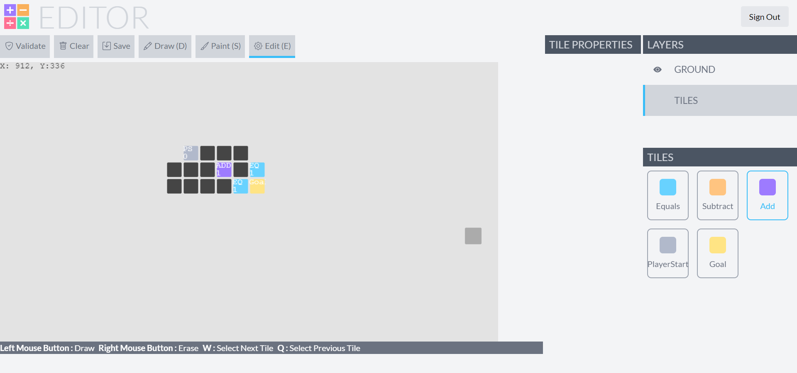
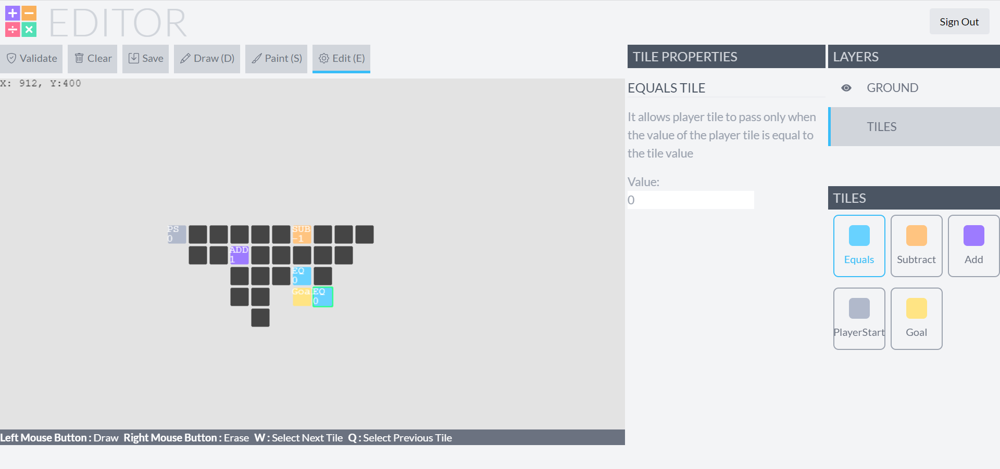

# Dashmath Editor

This project is an editor for a math based puzzle game called DashMath. The objective is to make the player tile reach the goal tile on the level. The level is filled with pick ups and obstacles. How do you get over them? Use MATHS! Because all the pick ups and obstacles are mathematical constraints. So play wisely!

## Screenshots

The possibilities are endles!



Edit mode provides functionality to edit tile values and much more.



## Running the project configuration

### Project Setup

```sh
npm install
```

### Compile and Hot-Reload for Development

```sh
npm run dev
```

### Type-Check, Compile and Minify for Production

```sh
npm run build
```

### Run Unit Tests with [Vitest](https://vitest.dev/)

```sh
npm run test:unit
```

### Run End-to-End Tests with [Cypress](https://www.cypress.io/)

```sh
npm run test:e2e:dev
```

This runs the end-to-end tests against the Vite development server.
It is much faster than the production build.

But it's still recommended to test the production build with `test:e2e` before deploying (e.g. in CI environments):

```sh
npm run build
npm run test:e2e
```

### Lint with [ESLint](https://eslint.org/)

```sh
npm run lint
```
